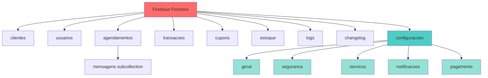
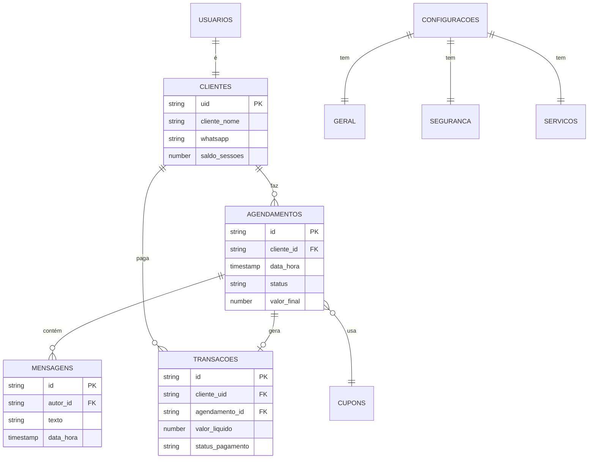

# Estrutura do Banco de Dados Firebase Firestore

## Visão Geral da Arquitetura



---

## 📋 Collections Principais

### 1. `clientes` Collection
**Documento ID:** `{uid}` (Firebase Auth UID)

```javascript
{
  uid: string,                    // ID único do Firebase Auth
  cliente_nome: string,           // Nome completo do cliente
  whatsapp: string,               // Telefone WhatsApp
  data_nascimento: Timestamp,     // Data de nascimento
  saldo_sessoes: number,          // Quantidade de sessões pré-pagas
  favoritos: string[],            // Lista de IDs de favoritos
  endereco: string,               // Endereço completo
  historico_medico: string,       // Histórico médico
  alergias: string,               // Alergias conhecidas
  medicamentos: string,           // Medicamentos em uso
  cirurgias: string,              // Histórico de cirurgias
  anamnese_ok: boolean            // Anamnese preenchida
}
```

**Índices Necessários:**
- `cliente_nome` (ASC)
- `whatsapp` (ASC)

---

### 2. `usuarios` Collection
**Documento ID:** Auto-gerado ou `{uid}`

```javascript
{
  id: string,                     // ID único do usuário
  nome: string,                   // Nome do usuário
  email: string,                  // E-mail de login
  tipo: string,                   // 'admin' | 'cliente'
  aprovado: boolean,              // Cliente aprovado pelo admin
  data_cadastro: Timestamp,       // Data de registro
  fcm_token: string,              // Token para notificações push
  visualiza_todos: boolean,       // Permissão para ver todos os dados
  theme: string                   // Tema preferido da UI
}
```

**Índices Necessários:**
- `email` (ASC)
- `tipo` + `aprovado` (ASC, ASC)

---

### 3. `agendamentos` Collection
**Documento ID:** Auto-gerado

```javascript
{
  cliente_id: string,             // ID do cliente (FK)
  data_hora: Timestamp,           // Data e hora do agendamento
  tipo: string,                   // Tipo de massagem
  tipo_massagem: string,          // Alias do tipo
  status: string,                 // 'pendente' | 'aprovado' | 'recusado' | 'cancelado'
  motivo_cancelamento: string,    // Motivo se cancelado
  lista_espera: string[],         // IDs de clientes na lista de espera
  data_criacao: Timestamp,        // Data de criação do registro
  
  // Snapshots para auditoria
  cliente_nome_snapshot: string,
  cliente_telefone_snapshot: string,
  
  // Avaliação pós-atendimento
  avaliacao: number,              // 1-5 estrelas
  comentario_avaliacao: string,
  
  // Financeiro
  cupom_aplicado: string,         // Código do cupom usado
  valor_original: number,         // Valor sem desconto
  valor_final: number,            // Valor com desconto
  preco: number                   // Alias do valor_final
}
```

**Subcollection:** `mensagens` (chat do agendamento)
```javascript
{
  texto: string,                  // Conteúdo da mensagem
  autor_id: string,               // ID do autor
  tipo: string,                   // 'texto' | 'imagem' | 'audio'
  data_hora: Timestamp,           // Data/hora do envio
  lida: boolean                   // Status de leitura
}
```

**Índices Necessários:**
- `cliente_id` + `data_hora` (ASC, DESC)
- `status` + `data_hora` (ASC, ASC)
- `data_hora` (ASC)

---

### 4. `transacoes` Collection
**Documento ID:** Auto-gerado

```javascript
{
  agendamento_id: string,         // ID do agendamento (FK, nullable)
  cliente_uid: string,            // ID do cliente (FK)
  valor_bruto: number,            // Valor original
  valor_desconto: number,         // Valor do desconto aplicado
  valor_liquido: number,          // Valor final após desconto
  metodo_pagamento: string,       // 'pix' | 'dinheiro' | 'cartao' | 'pacote'
  status_pagamento: string,       // 'pendente' | 'pago' | 'estornado'
  data_pagamento: Timestamp,      // Data do pagamento
  data_criacao: Timestamp,        // Data de criação do registro
  criado_por_uid: string          // ID do usuário que criou
}
```

**Índices Necessários:**
- `cliente_uid` + `data_pagamento` (ASC, DESC)
- `status_pagamento` + `data_pagamento` (ASC, DESC)
- `metodo_pagamento` (ASC)

---

### 5. `cupons` Collection
**Documento ID:** `{codigo}` (código do cupom em uppercase)

```javascript
{
  codigo: string,                 // Código do cupom (ex: DESC10)
  tipo: string,                   // 'porcentagem' | 'fixo'
  valor: number,                  // 10.0 (10% ou R$ 10,00)
  validade: Timestamp,            // Data de validade
  ativo: boolean                  // Cupom está ativo?
}
```

**Índices Necessários:**
- `ativo` + `validade` (ASC, ASC)

---

### 6. `estoque` Collection
**Documento ID:** Auto-gerado

```javascript
{
  nome: string,                   // Nome do item
  quantidade: number,             // Quantidade em estoque
  consumo_automatico: boolean     // Desconta ao aprovar agendamento?
}
```

**Índices Necessários:**
- `nome` (ASC)
- `quantidade` (ASC)

---

### 7. `logs` Collection
**Documento ID:** Auto-gerado

```javascript
{
  tipo: string,                   // 'info' | 'warning' | 'error' | 'critical'
  mensagem: string,               // Descrição do log
  data_hora: Timestamp,           // Momento do log
  usuario_id: string              // ID do usuário (se aplicável)
}
```

**Índices Necessários:**
- `tipo` + `data_hora` (ASC, DESC)
- `data_hora` (DESC)

---

### 8. `changelog` Collection
**Documento ID:** `{versao}` (ex: v1.0.0)

```javascript
{
  versao: string,                 // Versão do sistema
  data: Timestamp,                // Data de lançamento
  mudancas: string[],             // Lista de mudanças
  autor: string                   // Autor da versão
}
```

**Índices Necessários:**
- `data` (DESC)

---

## ⚙️ Collection `configuracoes`

### Documento: `configuracoes/geral`

```javascript
{
  // Configurações de agendamento
  horario_padrao_inicio: string,           // "08:00"
  horario_padrao_fim: string,              // "18:00"
  intervalo_agendamentos_minutos: number,  // 60
  tempo_antecedencia_minima_horas: number, // 24
  
  // Configurações de sono/bloqueio
  inicio_sono: number,                     // 22 (22:00)
  fim_sono: number,                        // 6 (06:00)
  tempo_bloqueio_noturno_inicio: string,   // "22:00"
  tempo_bloqueio_noturno_fim: string,      // "06:00"
  
  // Configurações de contato
  whatsapp_admin: string,                  // valor de WHATSAPP_ADMIN
  
  // Configurações de sessões
  preco_sessao: number,                    // 100.0
  
  // Configurações de interface
  biometria_ativa: boolean,                // true
  chat_ativo: boolean,                     // true
  recibo_leitura: boolean,                 // true
  status_campo_cupom: number,              // 0|1|2
  
  // Configurações de cancelamento
  horas_antecedencia_cancelamento: number, // 24.0
  
  // Campos obrigatórios no cadastro
  campos_obrigatorios: {
    whatsapp: boolean,                     // true
    endereco: boolean,                     // false
    data_nascimento: boolean,              // true
    historico_medico: boolean,             // false
    alergias: boolean,                     // false
    medicamentos: boolean,                 // false
    cirurgias: boolean,                    // false
    termos_uso: boolean                    // true
  }
}
```

### Documento: `configuracoes/seguranca`

```javascript
{
  senha_admin_ferramentas: string,         // Senha para DevTools
  tentativas_login_max: number,            // 3
  tempo_bloqueio_minutos: number           // 15
}
```

### Documento: `configuracoes/servicos`

```javascript
{
  tipos_massagem: string[],                // ["Relaxante", "Terapêutica", ...]
  duracao_padrao_minutos: number,          // 60
  preco_padrao: number                     // 150.0
}
```

### Documento: `configuracoes/notificacoes`

```javascript
{
  lembrete_antecedencia_horas: number,     // 24
  enviar_confirmacao_agendamento: boolean, // true
  enviar_lembrete_automatico: boolean      // true
}
```

### Documento: `configuracoes/pagamento`

```javascript
{
  aceita_pix: boolean,                     // true
  aceita_dinheiro: boolean,                // true
  aceita_cartao: boolean,                  // true
  taxa_cancelamento_percent: number,       // 50
  prazo_cancelamento_horas: number         // 24
}
```

---

## 🔒 Regras de Segurança (Security Rules)

```javascript
rules_version = '2';
service cloud.firestore {
  match /databases/{database}/documents {
    
    // Função auxiliar: verifica se é admin
    function isAdmin() {
      return request.auth != null && 
             get(/databases/$(database)/documents/usuarios/$(request.auth.uid)).data.tipo == 'admin';
    }
    
    // Função auxiliar: verifica se é o próprio usuário
    function isOwner(uid) {
      return request.auth != null && request.auth.uid == uid;
    }
    
    // Clientes - admin pode tudo, cliente só seus dados
    match /clientes/{clienteId} {
      allow read, write: if isAdmin();
      allow read, update: if isOwner(clienteId);
    }
    
    // Usuários - admin pode tudo, cliente só seus dados
    match /usuarios/{userId} {
      allow read, write: if isAdmin();
      allow read, update: if isOwner(userId);
    }
    
    // Agendamentos - admin pode tudo, cliente só seus agendamentos
    match /agendamentos/{agendamentoId} {
      allow read, write: if isAdmin();
      allow read: if request.auth != null && 
                     resource.data.cliente_id == request.auth.uid;
      allow create: if request.auth != null;
      
      // Mensagens do agendamento
      match /mensagens/{mensagemId} {
        allow read, write: if isAdmin();
        allow read, create: if request.auth != null;
      }
    }
    
    // Transações - apenas admin
    match /transacoes/{transacaoId} {
      allow read, write: if isAdmin();
    }
    
    // Cupons - leitura pública, escrita admin
    match /cupons/{cupomId} {
      allow read: if request.auth != null;
      allow write: if isAdmin();
    }
    
    // Estoque - apenas admin
    match /estoque/{itemId} {
      allow read, write: if isAdmin();
    }
    
    // Logs - apenas admin
    match /logs/{logId} {
      allow read, write: if isAdmin();
    }
    
    // Changelog - leitura pública, escrita admin
    match /changelog/{version} {
      allow read: if request.auth != null;
      allow write: if isAdmin();
    }
    
    // Configurações - apenas admin
    match /configuracoes/{doc} {
      allow read, write: if isAdmin();
    }
  }
}
```

---

## 📊 Valores Padrão do Sistema

Quando o sistema é inicializado pela primeira vez, os seguintes valores padrão são criados:

### Configurações Gerais
- Horário: 08:00 - 18:00
- Intervalo entre agendamentos: 60 minutos
- Antecedência mínima: 24 horas
- Horário de sono: 22:00 - 06:00
- Preço sessão: R$ 100,00
- Biometria, Chat, Recibo: Ativados

### Configurações de Segurança
- Tentativas de login: 3
- Tempo de bloqueio: 15 minutos
- Senha admin: (vazio - deve ser configurado)

### Configurações de Serviços
- Tipos de massagem: Relaxante, Terapêutica, Desportiva, Pedras Quentes
- Duração padrão: 60 minutos
- Preço padrão: R$ 150,00

### Configurações de Notificações
- Lembrete: 24 horas antes
- Confirmação automática: Ativada
- Lembretes automáticos: Ativados

### Configurações de Pagamento
- PIX, Dinheiro, Cartão: Aceitos
- Taxa de cancelamento: 50%
- Prazo para cancelamento: 24 horas

---

## 🔄 Diagrama de Relacionamentos



---

## 🚀 Inicialização Automática

O helper `FirestoreStructureHelper` garante que toda esta estrutura seja criada automaticamente quando necessário, evitando erros por dados ausentes.

```dart
// Uso:
final helper = FirestoreStructureHelper();
await helper.inicializarEstruturaConfiguracoes();
```

Este sistema garante:
✅ Criação automática de documentos ausentes  
✅ Merge de campos faltantes em documentos existentes  
✅ Valores padrão consistentes  
✅ Zero erros por dados não inicializados  

---

**Última atualização:** Março 2026  
**Versão do documento:** 1.0
